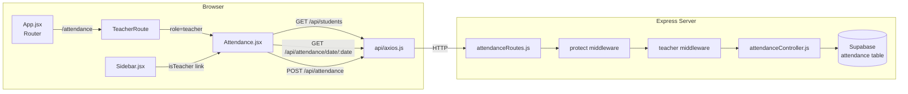

# Design Document — Teacher Attendance

## Overview

The Teacher Attendance feature adds a dedicated `/attendance` page to the teacher portal inside `user_frontend`. Teachers can select a date, optionally filter by student grade, mark each student as **Present**, **Absent**, or **Permission** using inline toggle buttons, and submit the batch to the backend in a single POST request. When a date already has records those records are pre-filled automatically. The backend attendance routes are tightened so that only users whose JWT payload role is `'teacher'` or `'admin'` may access them.

The design mirrors the existing **GradeReport** page (`GradeReport.jsx`) in structure, reusing the same CSS utility classes (`user-management-page`, `card`, `table-wrapper`, `management-table`) and the same authentication/API patterns already present in the project.

---

## Architecture



**Key interactions:**

1. `App.jsx` wraps `/attendance` in both `ProtectedRoute` (checks JWT presence) and a new `TeacherRoute` (checks role).
2. `Sidebar.jsx` renders an Attendance link only when `isTeacher` is true.
3. `attendanceRoutes.js` chains `protect` → `teacher` on all three routes.
4. `Attendance.jsx` follows the same two-phase pattern as `GradeReport.jsx`: load data on filter change, then let the teacher mutate and submit.

---

## Components and Interfaces

### 1. `TeacherRoute` (new, defined in `App.jsx`)

```jsx
const TeacherRoute = ({ children }) => {
    const token = localStorage.getItem('studentToken');
    if (!token) return <Navigate to="/signin" />;
    const info = JSON.parse(localStorage.getItem('studentInfo') || '{}');
    return info?.role === 'teacher' ? children : <Navigate to="/" />;
};
```

Props: `children` — the element to render when the guard passes.  
Side-effects: reads `localStorage`; triggers React Router redirect otherwise.

### 2. `Attendance.jsx` (new page component)

**State:**

| Name | Type | Purpose |
|---|---|---|
| `date` | `string` (YYYY-MM-DD) | Currently selected attendance date |
| `students` | `Student[]` | Alphabetically sorted list from API |
| `attendanceMap` | `Record<studentId, Status>` | Current status for each student |
| `gradeFilter` | `string` | Grade filter value ('' = All) |
| `loading` | `boolean` | Spinner while any network request is in-flight |
| `submitting` | `boolean` | True while POST is in-flight (disables save button) |
| `status` | `{ type: string, message: string }` | Feedback alert (type = `'success'`\|`'error'`\|`'warning'`) |

**Derived:** `filteredStudents` — `students` filtered by `gradeFilter`.

**Key handlers:**

- `fetchStudents()` — `GET /api/students?role=student`, sorts A→Z, stores to `students`.
- `fetchAttendanceForDate(date)` — `GET /api/attendance/date/:date`, builds `attendanceMap`.
- `handleStatusToggle(studentId, clickedStatus)` — toggles status (deselects if already active).
- `handleSubmit()` — validates at least one student has a status, then `POST /api/attendance`.
- `handleDateChange(newDate)` — clears feedback, sets `date`, calls `fetchAttendanceForDate`.

**Props received:** none (standalone page).

### 3. `Sidebar.jsx` (modified)

Add one new `<li>` inside the `{isTeacher && (...)}` block, rendered only when `isTeacher` is true:

```jsx
<li>
    <NavLink to="/attendance" onClick={toggleSidebar} className={({ isActive }) => isActive ? "active" : ""}>
        <FaCalendarCheck className="icon" title={t('navbar.attendance') || 'Attendance'} />
        <span className="label">{t('navbar.attendance') || 'Attendance'}</span>
    </NavLink>
</li>
```

Import: `FaCalendarCheck` from `react-icons/fa`.

### 4. `App.jsx` (modified)

Add the import and route:

```jsx
import Attendance from './Pages/Attendance';

// TeacherRoute guard (new)
const TeacherRoute = ({ children }) => { ... };

// Inside <Routes>:
<Route path="/attendance" element={
    <TeacherRoute>
        <Attendance />
    </TeacherRoute>
} />
```

### 5. `attendanceRoutes.js` (modified)

Replace the standalone `protect` on all three routes with the `protect` + `teacher` chain:

```js
const { protect, teacher } = require('../middleware/authMiddleware');

router.post('/',                 protect, teacher, recordAttendance);
router.get('/report',            protect, teacher, getAttendanceReport);
router.get('/date/:date',        protect, teacher, getAttendanceByDate);
```

---

## Data Models

### Frontend — `AttendanceMap`

```ts
type Status = 'Present' | 'Absent' | 'Permission';
type AttendanceMap = Record<string, Status>; // keyed by student UUID
```

### Frontend — `Student` (as returned by `/api/students`)

```ts
interface Student {
    id: string;
    name: string;
    christianName?: string;
    grade?: string;
    role: string;
}
```

### Backend POST body — `POST /api/attendance`

```json
{
  "date": "2025-07-15",
  "records": [
    { "student": "uuid-abc", "status": "Present" },
    { "student": "uuid-def", "status": "Absent" }
  ]
}
```

Students with no status set are **excluded** from `records`.

### Supabase `attendance` table (existing)

| Column | Type | Notes |
|---|---|---|
| `student_id` | UUID (FK → students.id) | |
| `date` | DATE | |
| `status` | TEXT | `'Present'` \| `'Absent'` \| `'Permission'` |

Unique constraint: `(student_id, date)` — upsert is used on write.

---

## Correctness Properties

*A property is a characteristic or behavior that should hold true across all valid executions of a system — essentially, a formal statement about what the system should do. Properties serve as the bridge between human-readable specifications and machine-verifiable correctness guarantees.*

### Property 1: Toggle Exclusivity

*For any* student in the attendance list, at most one status button (`Present`, `Absent`, `Permission`) shall be in the active state at any time. Clicking a different button activates it and deactivates the previous one; clicking the already-active button deactivates it with no other button becoming active.

**Validates: Requirements 7.2, 7.4, 7.5, 7.6**

---

### Property 2: Submission Payload Completeness

*For any* attendance map containing N students with statuses set, the POST payload's `records` array shall have exactly N entries, each containing the correct `student` id and `status`, and shall contain no entries for students whose status is unset.

**Validates: Requirements 9.2, 9.6**

---

### Property 3: Pre-fill Round Trip

*For any* date and set of attendance records submitted via `POST /api/attendance`, subsequently requesting `GET /api/attendance/date/:date` and pre-filling the attendance map shall produce a map whose entries exactly match the submitted records (same student ids, same statuses).

**Validates: Requirements 8.1, 8.2, 8.5**

---

### Property 4: Grade Filter Correctness

*For any* grade filter value G selected from the dropdown, every student row displayed in the table shall have a `grade` field that exactly matches G; no student with a different grade shall appear, and no student with grade G shall be omitted.

**Validates: Requirements 6.2, 6.3**

---

### Property 5: Backend Role Authorization

*For any* JWT token whose payload role is not `'teacher'` or `'admin'`, every request to `POST /api/attendance`, `GET /api/attendance/date/:date`, and `GET /api/attendance/report` shall receive HTTP 403. Conversely, *for any* JWT token whose payload role is `'teacher'` or `'admin'`, those same endpoints shall not return 401 or 403.

**Validates: Requirements 1.1 – 1.7**

---

## Error Handling

| Scenario | Behaviour |
|---|---|
| `GET /api/students` fails | Set `status.type = 'error'` with message; show error alert; leave table empty |
| `GET /api/attendance/date/:date` fails | Set `status.type = 'error'`; preserve existing `attendanceMap` toggle states (Req 8.4) |
| `POST /api/attendance` fails (4xx / 5xx) | Set `status.type = 'error'` with descriptive message; re-enable save button |
| No student has status set on submit | Set `status.type = 'warning'`; do not call the API (Req 9.6) |
| Network timeout | Treat as a generic request failure; display error alert |
| Token missing / expired | Backend returns 401; frontend should detect and can redirect to `/signin` |

A single `status` state object (`{ type, message }`) drives all alert rendering. Only one alert is shown at a time (Req 10.4). Feedback is auto-dismissed after 5 seconds via `setTimeout` cleared on the next state change (Req 10.5).

---

## Testing Strategy

### Unit / Example-based Tests

| Test | What is verified |
|---|---|
| `TeacherRoute` redirects non-teacher to `/` | Role-guard logic |
| `TeacherRoute` redirects unauthenticated user to `/signin` | Auth-guard logic |
| `TeacherRoute` renders children for role=teacher | Happy path |
| `handleSubmit` does NOT call API when `attendanceMap` is empty | Req 9.6 validation |
| `handleSubmit` disables button during in-flight request | Req 9.5 |
| Feedback alert auto-dismisses after 5 seconds | Req 10.5 |
| `attendanceRoutes.js` — unauthenticated request returns 401 | Req 1.1, 1.3, 1.5 |
| `attendanceRoutes.js` — student role returns 403 | Req 1.2, 1.4, 1.6 |

### Property-based Tests

The following correctness properties are well-suited to property-based testing. The project uses JavaScript/React, so **fast-check** is the recommended PBT library (pure JS, no extra runtime, works with Vitest).

Each test must run a minimum of **100 iterations**.

Tag format: `Feature: teacher-attendance, Property {N}: {property_text}`

**Property 1 — Toggle Exclusivity**  
Generate a random sequence of `(studentId, status)` click events. After replaying each event through `handleStatusToggle`, assert that `Object.values(attendanceMap)` contains at most one value per student id, and the last click wins (or clears if same as previous).  
`// Feature: teacher-attendance, Property 1: toggle exclusivity`

**Property 2 — Submission Payload Completeness**  
Generate a random `attendanceMap` (some students have statuses, some do not). Run the payload-building logic and assert: `records.length === Object.keys(attendanceMap).filter(id => attendanceMap[id]).length`, and every record's `status` equals `attendanceMap[record.student]`.  
`// Feature: teacher-attendance, Property 2: submission payload completeness`

**Property 3 — Pre-fill Round Trip**  
Generate random attendance records `[{ student, status }]`. Mock `POST /api/attendance` to store them, mock `GET /api/attendance/date/:date` to return them. Run `fetchAttendanceForDate`, then assert the resulting `attendanceMap` matches the original records.  
`// Feature: teacher-attendance, Property 3: pre-fill round trip`

**Property 4 — Grade Filter Correctness**  
Generate a random student list with varying grade values and a random grade filter selection. Apply the client-side filter logic. Assert every student in the result matches the filter, and every matching student from the original list appears in the result.  
`// Feature: teacher-attendance, Property 4: grade filter correctness`

**Property 5 — Backend Role Authorization**  
Generate random JWT payloads with random role strings. For each, assert that the `teacher` middleware returns 403 when `role ∉ {'teacher','admin'}` and calls `next()` when `role ∈ {'teacher','admin'}`.  
`// Feature: teacher-attendance, Property 5: backend role authorization`
